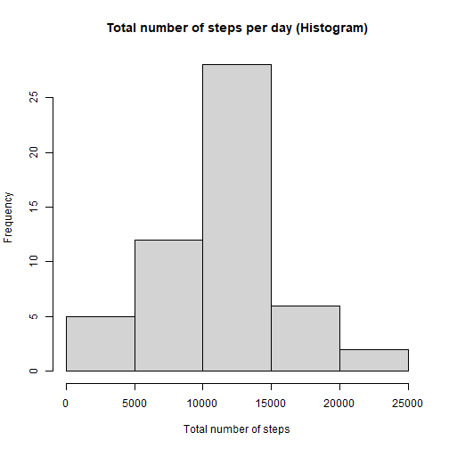
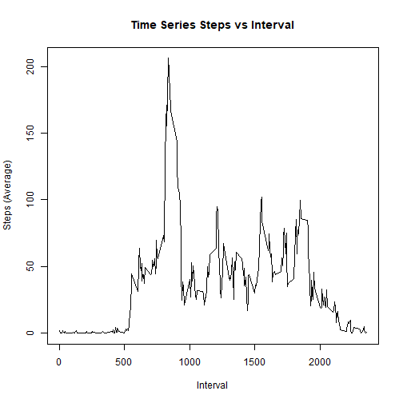
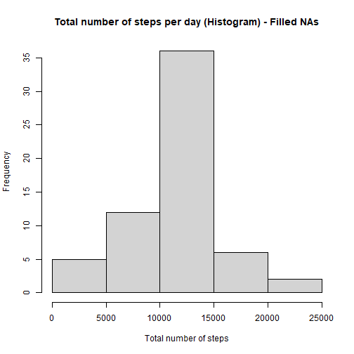
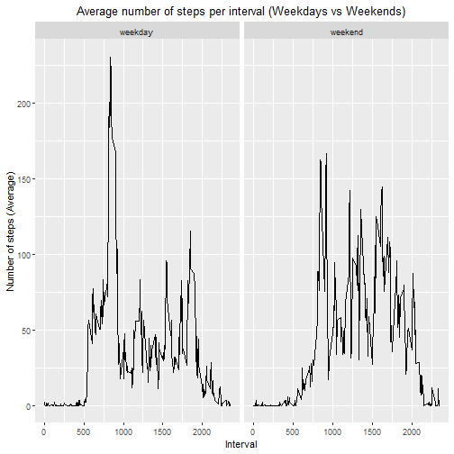

# Reproducible Research - Peer Review Assignment #1  

By: Kirill Tristán  

Before starting the analysis, we need to check if the required packages are installed.

```r
packages<-c("lubridate","dplyr","ggplot2")
install.packages(setdiff(packages, rownames(installed.packages()))) 
library(lubridate)
library(dplyr)
library(ggplot2)
```

## Part 1: Loading and preprocessing the data

1. Load the data:

```r
act<-read.csv("activity.csv",na.strings = "NA")
```
2. Process the data.For this step, the only applied process was to change the date variable class, from character to date.

```r
act$date<-ymd(act$date)
```

## Part 2: What is mean total number of steps taken per day?

1. Total number of steps taken per day.

```r
act1<-act%>%
  group_by(date)%>%
  summarise(sum=sum(steps))
act1
```

```
## # A tibble: 61 x 2
##    date         sum
##    <date>     <int>
##  1 2012-10-01    NA
##  2 2012-10-02   126
##  3 2012-10-03 11352
##  4 2012-10-04 12116
##  5 2012-10-05 13294
##  6 2012-10-06 15420
##  7 2012-10-07 11015
##  8 2012-10-08    NA
##  9 2012-10-09 12811
## 10 2012-10-10  9900
## # ... with 51 more rows
```

2. Histogram of the total number of steps taken each day.

```r
hist(act1$sum,main="Total number of steps per day (Histogram)",
     xlab="Total number of steps")
```



3. Mean and median of the total number fo steps taken per day.

```r
act2<-act%>%
  group_by(date)%>%
  summarise(mean=mean(steps),median=median(steps))
act2
```

```
## # A tibble: 61 x 3
##    date         mean median
##    <date>      <dbl>  <dbl>
##  1 2012-10-01 NA         NA
##  2 2012-10-02  0.438      0
##  3 2012-10-03 39.4        0
##  4 2012-10-04 42.1        0
##  5 2012-10-05 46.2        0
##  6 2012-10-06 53.5        0
##  7 2012-10-07 38.2        0
##  8 2012-10-08 NA         NA
##  9 2012-10-09 44.5        0
## 10 2012-10-10 34.4        0
## # ... with 51 more rows
```

## Part 3: What is the average activity pattern?

1. Time series plot of the 5-minute interval and the average number of steps taken, averaged across all days. 

```r
act3<-act%>%
  group_by(interval)%>%
  summarise(mean=mean(steps,na.rm=TRUE))
with(act3,plot(interval,mean,type="l",main="Time Series Steps vs Interval",
               xlab="Interval",ylab="Steps (Average)"))
```



2. Which 5-minute interval, on average across all the days in the data set, contains the maximum number of steps?

    **The 835 interval with an average of 206 steps.**

## Part 4: Imputing missing values

1. Total number of missing values:


```r
sum(is.na(act$steps))
```

```
## [1] 2304
```

2. The strategy used for filling the missing values was to use the mean for the 5-minute interval.

3. New dataset with missing values filled in. 

```r
act6<-act
act4<-act
act6<-as_tibble(act6)
act5<-act3
act5$mean<-as.integer(act5$mean)
for(i in 1:length(act4$steps)) {
  if (is.na(act4[i,1])){
    m<-match(act4[i,3],act5$interval)
    act6[i,1]<-act5[m,2]
  }else
    next
}
```

4. Histogram of the total number of steps taken each day.


```r
act7<-act6%>%
  group_by(date)%>%
  summarise(sum=sum(steps))
hist(act7$sum,main="Total number of steps per day (Histogram) - Filled NAs",
     xlab="Total number of steps")
```



4. Median and mean

```r
act8<-act6%>%
  group_by(date)%>%
  summarise(mean=mean(steps),median=median(steps))
act8
```

```
## # A tibble: 61 x 3
##    date         mean median
##    <date>      <dbl>  <dbl>
##  1 2012-10-01 36.9     33.5
##  2 2012-10-02  0.438    0  
##  3 2012-10-03 39.4      0  
##  4 2012-10-04 42.1      0  
##  5 2012-10-05 46.2      0  
##  6 2012-10-06 53.5      0  
##  7 2012-10-07 38.2      0  
##  8 2012-10-08 36.9     33.5
##  9 2012-10-09 44.5      0  
## 10 2012-10-10 34.4      0  
## # ... with 51 more rows
```
**The values do differ when compared with originals. The major impact could be seen between 10000 and 15000 steps, were the original dataset showed 26 days while the modified dataset (no NAs) showed 36 days. In my opinion, this kind of estimates are acceptable, as long as, the method is thoroughly tested.**

## Part 5: Are there differences in activity patterns between weekdays and weekends?

1.New factor variable: Weekends, weekdays.

```r
act9<-NULL
for(i in 1:length(act$steps)) {
if (weekdays(act[i,2])%in%c("lunes","martes","miércoles","jueves","viernes")){
   act9[i]<-1
    }else
   act9[i]<-2
}
act9<-as.data.frame(act9)
names(act9)<-"daytype"
act9$daytype<-as.factor(act9$daytype)
levels(act9$daytype)<-c("weekday","weekend")
act6<-cbind(act6,act9)
act6<-as_tibble(act6)
```

2.Time series of 5-minute interval and the average number of steps taken, averaged across all weekday days or weekends days.

```r
act10<-act6%>%
  group_by(daytype,interval)%>%
  summarise(mean=mean(steps,na.rm=TRUE))
```

```
## `summarise()` has grouped output by 'daytype'. You can override using the `.groups` argument.
```

```r
  qplot(interval,mean,data=act10,facets = .~ daytype,geom = "line",
        xlab = "Interval", ylab="Number of steps (Average)", main =
        "Average number of steps per interval (Weekdays vs Weekends)") +
        theme(plot.title = element_text(hjust = 0.5))
```




